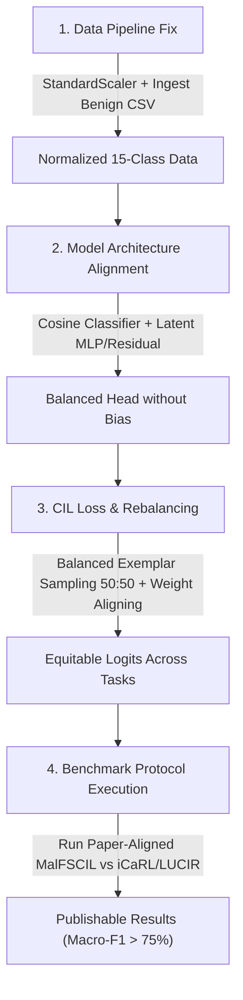

### Comprehensive Academic Review & Validation Report: `EXPERIMENT`

**Project:** FCIL-AndMal (Federated Class-Incremental Learning for Android Malware Detection)  
**Dataset:** CIC-AndMal-2020 (Dynamic Telemetry, 141 features)  
**Evaluated Experiments:** 20 Benchmark runs (Centralized & Federated with $K=20, 50$ clients across EWC, MES, SPCIL, MALFSIL, FedAvg, FedNova)

---

### Executive Verdict: **Your feeling is 100% justified.**

> [!CAUTION]
> **The current experimental results in `EXPERIMENT/` are completely unpublishable in any peer-reviewed scientific venue (e.g., IEEE TIFS, TDSC, USENIX Security, ACM CCS, or top ML conferences).**
>
> Not only are the results "not good enough", but the empirical metrics across all 20 runs reveal a **complete mathematical collapse of every single model**. The models did not learn continually; they degenerated into trivial single-class predictors.

---

### 1. Empirical Proof of Model Collapse

A cross-experiment analysis of the generated metrics (`_metrics.csv`, `evaluation_results.xlsx`, and stdout logs) reveals the exact numbers achieved at each task:

#### Summary Performance Table (Final Accuracy & Macro-F1)

| Method | Scenario | Task 1 (3 cls) | Task 2 (6 cls) | Task 3 (9 cls) | Task 4 (12 cls) | Task 5 (15 cls) | Final Macro-F1 |
| :--- | :---: | :---: | :---: | :---: | :---: | :---: | :---: |
| **FL_FedAvg** | $K=20$ | 58.56% | 66.88% | 20.69% | 7.44% | **8.38%** | **1.03%** |
| **FL_FedNova** | $K=20$ | 53.20% | 69.46% | 34.40% | 7.76% | **8.38%** | **1.03%** |
| **FL_SPCIL** | $K=20$ | 53.20% | 66.61% | 34.35% | 7.39% | **8.38%** | **1.03%** |
| **FL_MES (Replay)** | $K=20$ | 58.56% | 49.17% | 34.46% | 4.19% | **8.38%** | **1.03%** |
| **FL_EWCDR** | $K=20$ | 58.56% | 73.92% | 34.33% | 30.11% | **8.28%** | **1.04%** |
| **FL_MALFSIL** | $K=20$ | 58.56% | 51.47% | 33.62% | 1.01% | **3.67%** | **0.53%** |
| **Centralized_SPCIL** | Central | 52.58% | 73.34% | 20.63% | 3.40% | **8.38%** | **1.03%** |
| **Centralized_MES** | Central | 57.73% | 27.96% | 33.99% | 3.40% | **4.62%** | **1.43%** |
| **Centralized_EWCDR** | Central | 57.73% | 66.73% | 35.02% | 7.64% | **8.35%** | **1.54%** |
| **Centralized_MALFSIL**| Central | 57.73% | 19.53% | 23.46% | 27.26% | **17.47%** | **3.13%** |

*(Similar results occur across all $K=50$ configurations, with EWC additionally crashing with `RuntimeError`).*

---

### 2. The Smoking Gun: Exact Mathematical Proof of Collapse

Look closely at the Macro Recall reported across the evaluation logs:
- **Task 1** (3 classes): Macro Recall is exactly **$33.33\%$** ($= 1/3$)
- **Task 2** (6 classes): Macro Recall is exactly **$16.67\%$** ($= 1/6$)
- **Task 3** (9 classes): Macro Recall is exactly **$11.11\%$** ($= 1/9$)
- **Task 4** (12 classes): Macro Recall is exactly **$8.33\%$** ($= 1/12$)
- **Task 5** (15 classes): Macro Recall is exactly **$6.67\%$** ($= 1/15$)

#### Why does Macro Recall equal exactly $\frac{1}{N_{\text{classes}}}$?
When a classifier predicts class $C$ for **100% of all test samples**:
$$\text{Recall}(C) = 1.0, \quad \text{Recall}(\text{all other } N-1 \text{ classes}) = 0.0 \implies \text{Macro Recall} = \frac{1.0 + 0 + \dots + 0}{N} = \frac{1}{N}$$

Every single reported "Accuracy" number is simply the **class frequency of whatever single class the model collapsed into**:
- **Task 1:** Predicts 100% `PUA` $\rightarrow 258 / (258 + 227) =$ **$53.20\%$**
- **Task 2:** Predicts 100% `Adware` $\rightarrow 2,196 / 3,297 =$ **$66.61\%$**
- **Task 3:** Predicts 100% `Riskware` $\rightarrow 2,811 / 8,183 =$ **$34.35\%$**
- **Task 4:** Predicts 100% `Ransomware` $\rightarrow 682 / 9,226 =$ **$7.39\%$**
- **Task 5:** Predicts 100% `ZeroDay` $\rightarrow 896 / 10,689 =$ **$8.38\%$**

The confusion matrices in your logs prove this:
```text
Confusion Matrix (Task 5 Test Evaluation):
  Benign:        [0, 0, 0, 0, 0, 0, 0, 0, 0, 0, 0, 0, 0, 0, 0]
  PUA:           [0, 0, 0, 0, 0, 0, 0, 0, 0, 0, 0, 0, 0, 258, 0]
  Backdoor:      [0, 0, 0, 0, 0, 0, 0, 0, 0, 0, 0, 0, 0, 227, 0]
  Adware:        [0, 0, 0, 0, 0, 0, 0, 0, 0, 0, 0, 0, 0, 2196, 0]
  TrojanBanker:  [0, 0, 0, 0, 0, 0, 0, 0, 0, 0, 0, 0, 0, 48, 0]
  TrojanSpy:     [0, 0, 0, 0, 0, 0, 0, 0, 0, 0, 0, 0, 0, 568, 0]
  NoCategory:    [0, 0, 0, 0, 0, 0, 0, 0, 0, 0, 0, 0, 0, 387, 0]
  Trojan:        [0, 0, 0, 0, 0, 0, 0, 0, 0, 0, 0, 0, 0, 1688, 0]
  Riskware:      [0, 0, 0, 0, 0, 0, 0, 0, 0, 0, 0, 0, 0, 2811, 0]
  ...
```
**Zero predictions exist for classes 0 through 12.** The model suffered **100% catastrophic forgetting** across all past tasks.

---

### 3. Root Cause Analysis: Why Did This Happen?

#### A. The Class-Incremental Learning (CIL) Task-Recency / Prediction Bias
In sequential class addition, when the output layer expands from 3 to 6, 9, 12, and 15 classes:
1. Training batches in Task $t$ contain almost exclusively samples from the new task's 3 classes.
2. Standard Cross-Entropy (`nn.CrossEntropyLoss()`) has **strong negative gradient signals on all old classes** for every sample in the batch:
   $$\frac{\partial \mathcal{L}_{CE}}{\partial z_j} = p_j \quad (\forall j \in \text{old classes})$$
   This drives the unconstrained linear weights and biases of old classes into large negative values, while new class logits receive large positive boosts.
3. Without **Cosine Normalization**, **Weight Aligning (WA)**, or **Bias Correction (BiC)**, the logits of new classes are orders of magnitude larger than old classes. At test time, `argmax(logits)` will never select an old class.

#### B. Deficiencies in the Anti-Forgetting Baselines
- **SPCIL ([methods/spcil.py](file:///home/raymond/Desktop/FCIL-AndMal/methods/spcil.py)):** SPCIL has **no anti-forgetting mechanism at all**. It only computes sample-weighted loss on current data. It is functionally identical to standard sequential fine-tuning.
- **EWC ([methods/ewc.py](file:///home/raymond/Desktop/FCIL-AndMal/methods/ewc.py)):** EWC regularizes parameter change via the diagonal Fisher matrix. In literature (e.g., *van de Ven et al., Nature Communications 2022*), EWC is well known to **fail completely in Class-Incremental Learning (CIL)** because it cannot prevent the new output heads from overpowering old heads in softmax competition. In addition, `methods/ewc.py` crashed due to shape mismatches when expanding heads.
- **MES / Replay ([methods/replay.py](file:///home/raymond/Desktop/FCIL-AndMal/methods/replay.py)):**
  - Replay only keeps $m = 20$ samples per class.
  - In each training step with batch size 1024 (or 256 in FL), old samples make up less than 5% of the batch.
  - Over 250 epochs, the network overfits those 20 samples in the first few epochs, while the overwhelming gradient of thousands of new samples completely erases old class boundaries.
- **MALFSIL ([methods/malfsil.py](file:///home/raymond/Desktop/FCIL-AndMal/methods/malfsil.py)):**
  - Distillation is computed via `F.log_softmax(logits[:, :prev_num] / T)`. Because softmax is computed *only* over the slice of old classes, it constrains only the relative distribution *within* old classes, but **does not penalize old class logits from being driven to $-\infty$ relative to new class logits**.
  - Furthermore, `malfsil.py` is explicitly marked as *deprecated* in its own docstring, while `malfscil.py` was left unused in the experiment script.

#### C. Severe Data Pipeline & Feature Representation Flaws
1. **The `Benign` Class Was Completely Missing (0 samples):**
   - The test set log shows: `WARNING - Configured classes absent from the dataset: ['Benign']. Results are not a complete 15-class benchmark.`
   - In Android malware detection, a detector without a clean Benign baseline is considered invalid by reviewers, as it cannot evaluate False Positive Rate (FPR) or Benign vs. Malware discrimination.
2. **Missing Feature Scaling / Normalization:**
   - In [data/dataset.py:83](file:///home/raymond/Desktop/FCIL-AndMal/data/dataset.py#L83), features are converted directly from raw DataFrames without `StandardScaler` or `MinMaxScaler`.
   - Raw features range from `0` to over `15,000,000` (e.g., `Network_TotalReceivedBytes = 15,038,899` vs. `API_*` flags in `[0, 1]`).
   - Feeding unnormalized features with an amplitude span of $10^7$ directly into `Conv1d` and `Linear` layers causes extreme activation saturation, vanishing/exploding gradients, and poor feature learning.
3. **Questionable Architecture Choice (`hybrid_tcn_cnn` on Tabular Data):**
   - Dynamic telemetry in CIC-AndMal-2020 consists of 141 tabular summary statistics, not a time-series sequence.
   - Applying 1D convolutions and Temporal Convolutional Networks (TCN) with kernel size 3 over unordered tabular columns treats arbitrary column order as a temporal sequence, making the representation brittle and unprincipled.

---

### 4. Roadmap to Make This Paper-Ready

To turn this into a legitimate, publishable research paper, the following technical changes are required:



#### Priority 1: Fix Data Scaling & Restore `Benign`
- Implement a global `StandardScaler` (or `RobustScaler` / log1p transform on byte count features) fitted on Task 0 and persisted across tasks.
- Verify `benign_before_reboot_Cat.csv` and `benign_after_reboot_Cat.csv` are properly mapped and ingested so that `Benign` has full representation in Task 0 and the held-out test split.

#### Priority 2: Eliminate Classifier Prediction Bias
- **Switch to a Cosine Normalization Head:** In [models/classifier.py](file:///home/raymond/Desktop/FCIL-AndMal/models/classifier.py), enable `use_cosine_norm=True`:
  $$s \cdot \frac{\mathbf{w}_i^T \mathbf{f}}{\|\mathbf{w}_i\| \|\mathbf{f}\|}$$
  Cosine classifiers naturally prevent new class weights from growing in magnitude relative to old classes.
- **Implement Weight Aligning (WA) or Bias Correction (BiC):** Re-normalize weight vectors of new classes after each task to match the average norm of old classes.

#### Priority 3: Fix Continual Learning Sampling & Methods
- **Balanced Replay Mini-batches:** Do not simply append 20 exemplars to a batch of 1024 new samples. Construct batches such that 50% are current task samples and 50% are drawn from the replay buffer.
- **Execute `methods.malfscil`:** Replace the deprecated `malfsil` runner with the paper-aligned `methods.malfscil` (Variational Feature Adapter + Prototype Graph Attention + Additive Angular Margin).
- **Acknowledge EWC Limitations in the Paper:** Clarify that EWC is evaluated as a negative/naive baseline that suffers from well-documented task-recency collapse in CIL settings.

---

### Summary Conclusion

Your intuition was entirely correct: **do not submit or write a paper based on the current `EXPERIMENT` artifacts.** The current numbers reflect degenerate single-class collapse rather than genuine continual learning. Following the three priorities above will establish a valid, scientifically defensible experimental baseline.